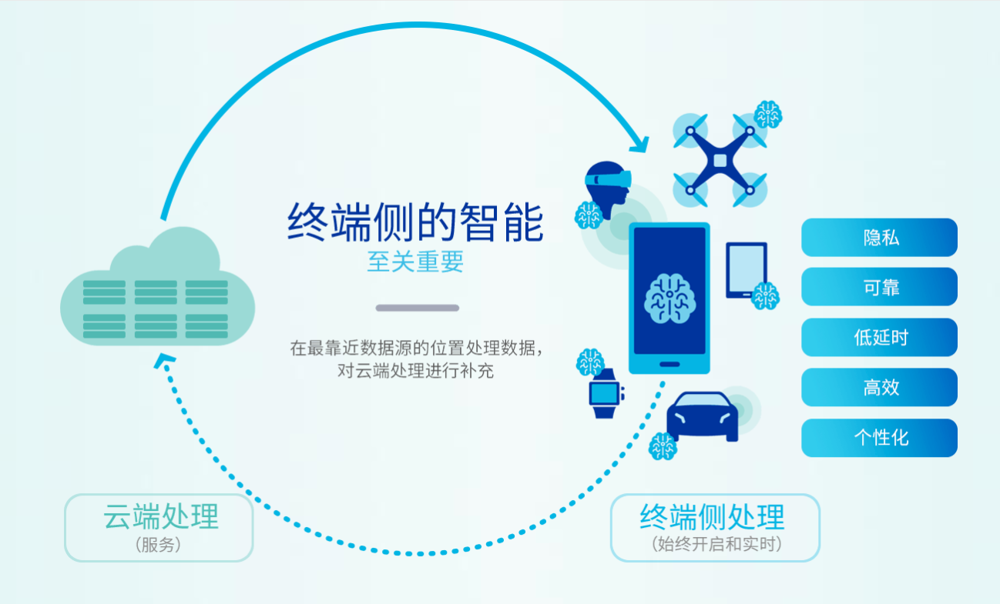
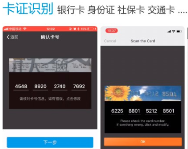

# FrontEnd+

探索前端的更多可能

## 端侧AI（On-device AI)

端：物联网中的任何终端

AI+IoT=AIoT

>先看一个[新闻：5G手机重视AI](https://mp.weixin.qq.com/s/BKzwviY21V7Zf_Ja9RCBYA)

### 端侧AI的优势

1.隐私:数据存储本地无需上传

2.可靠:降低数据上传云端链路过长导致的错误率

3.低延时:本地存储计算

4.低成本|高效:减少不必要流量,选择性占用网络宽带资源

5.个性化:持续学习,模型调整,隐私保护的分布式学习.带来个性化的互动与体验

### 端侧AI的难点

1.硬件资源限制
    存储、内存、计算资源

2.模型的版本管理、生命周期

3.终端的种类很多，不同硬件架构的适配和模型迁移成本过高

4.3同时导致了端侧AI应用复杂度增加

### 云端协同

终端侧处理+云端处理补充:协同合作（云端协同）

### 技术建设

[TensorflowLite](https://www.tensorflow.org/lite)

阿里的[MNN](https://github.com/alibaba/MNN)：轻量级的深度学习端侧推理引擎

> <https://mp.weixin.qq.com/s/LoLI6Rpw4izk7p_U5MzJ2Q>

### 应用

#### 微信

小程序+AI

#### 阿里

### WebAssembly => IoT

> [WebAssembly在物联网的应用](https://mp.weixin.qq.com/s/FFuWbU0WyVAf3n2IoAVn5w)
>
> [MDN Webassembly](https://developer.mozilla.org/en-US/docs/WebAssembly)

### 参考

<https://www.qualcomm.cn/on-device-ai/details>

<https://zhuanlan.zhihu.com/p/129876992>

## 前端机器学习

### Tensorflow.js

示例阿玛尼AR小程序

### 阿里PipCook

基于Tensorflow.js，为 JavaScript 开发者提供的机器学习工具集。

与[Tensorflow](https://www.tensorflow.org/)的区别在于全程JS环境，且专注于前端领域。

<https://alibaba.github.io/pipcook/#/>

<https://mp.weixin.qq.com/s/WYmhBBb1x2cbdFSweNooNQ>

## No code|Low code:生成前端代码

### D2C:Design to code

+ [sketch2code](https://sketch2code.azurewebsites.net/)：手稿=>code(html)
+ [imgcook](https://www.imgcook.com/)：设计稿=>code(React等)

>[前端智能代码是怎样生成的]<https://www.imgcook.com/blog>

参考
<https://mp.weixin.qq.com/s/WYmhBBb1x2cbdFSweNooNQ>

### D2C:DATA to code

阿里[AVA](https://github.com/antvis/AVA/blob/master/zh-CN/README.zh-CN.md)

参考
<https://mp.weixin.qq.com/s/NB3mPLktt_LytvUrtf3vow>

### 生成form表单

阿里[Formily](https://formilyjs.org/#/xbS7SW/VbsNsDCe)
Json Schema=>Code
JSX Schema=>Code

## Webxr
