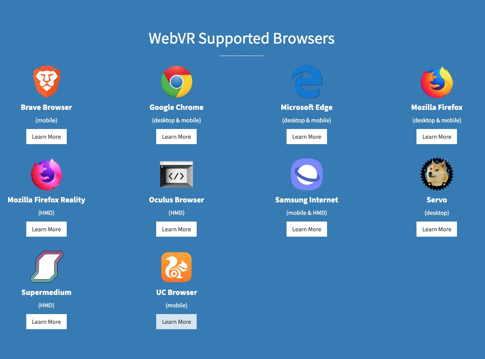

### 应用场景

#### 旅游景区

已有：
app:just be here

蚁视在2015年就做了故宫文渊阁VR版，虚拟场景的制作、VR沉浸式游览、VR拍摄。

#### 酒店

#### VR主题公园

#### VR游戏配合游乐项目

#### 配合旅行社交

#### VR/AR配合营销活动

### 难点

#### ROI太低

1. 设备费用高
每台设备要10000元以上

2. VR视频拍摄和虚拟场景制作费用高
eg.  Oculus 2017年拍摄的6分钟VR电影竟花了上千万人民币，赞那度拍摄的酒店视频也达到每部30-80万人民币

> 一般而言，VR内容的呈现分两种情况，第一种是实景拍摄，第二种是3D建模场景制作，这其中又包含可以在场景中行走和不可以行走，每个VR内容制作需要设计师、程序员、拍摄组、后期制作等多环节、多专业人员配合。
>
> 实景内容制作相对简单，只需要利用全景相机进行拍摄。但这样的展示模式缺乏创新，而且在一些旅游项目中，需要更多的交互元素。
>
> <https://www.traveldaily.cn/article/124149>

3. 营销效果不如传统地推和宣传

> 虽然科技效应在旅游行业有所显现，但对于体量不大的地域性旅行社，获客最主要在于当地的地推和宣传，因为门店数量有限，VR展示效果可能不如多做活动。
>
> <https://www.traveldaily.cn/article/124149>

#### 技术问题

1. 沉浸感差，原因如下

+ 图像分辨率太低，骗不过眼睛；
+ 有明显的图像边界，就是手机屏幕的边界；
+ 没有双眼单独运算产生的纵深感，你看到的只是一副展开在眼前的巨大球面图像而已。
+ 触觉味觉等其他知觉不完善
+ 时延严重，渲染时延严重

2. 需要VR头盔，不适合长时间体验，体验也不好

3. 造价成本高

### 仅技术方面

支持浏览器

what's webxr
> <https://github.com/immersive-web/webxr/blob/master/explainer.md>

webxr device api
> <https://immersive-web.github.io/webxr/>

openxr
> <https://www.khronos.org/openxr>

what's webvr
> <https://webvr.info/>

#### 计划

1. 研究webgl/three.js

> <https://zhuanlan.zhihu.com/p/27784091>

2. webvr

> <https://webvr.info/developers/>
>
> React 360, a framework for the creation of 3D and VR user interfaces: <https://facebook.github.io/react-360/>

3. webar

> <https://github.com/jeromeetienne/AR.js>
>
> Google AR: <https://github.com/google-ar>
>
> Google AR helper three.js: <https://github.com/google-ar/three.ar.js>

4. 一些成品

> <https://webvr.directory/>
>
> <https://experiments.withgoogle.com/collection/webvr>

### 参考

> <https://zhuanlan.zhihu.com/p/35068248>
>
> <https://www.traveldaily.cn/article/124149>
>
> abcnews.go.com
