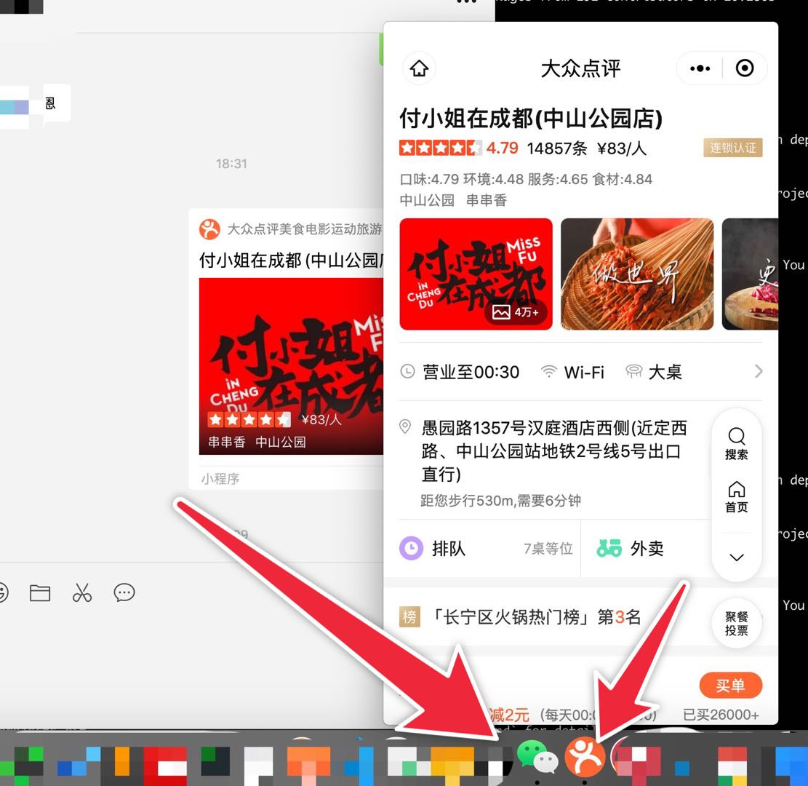
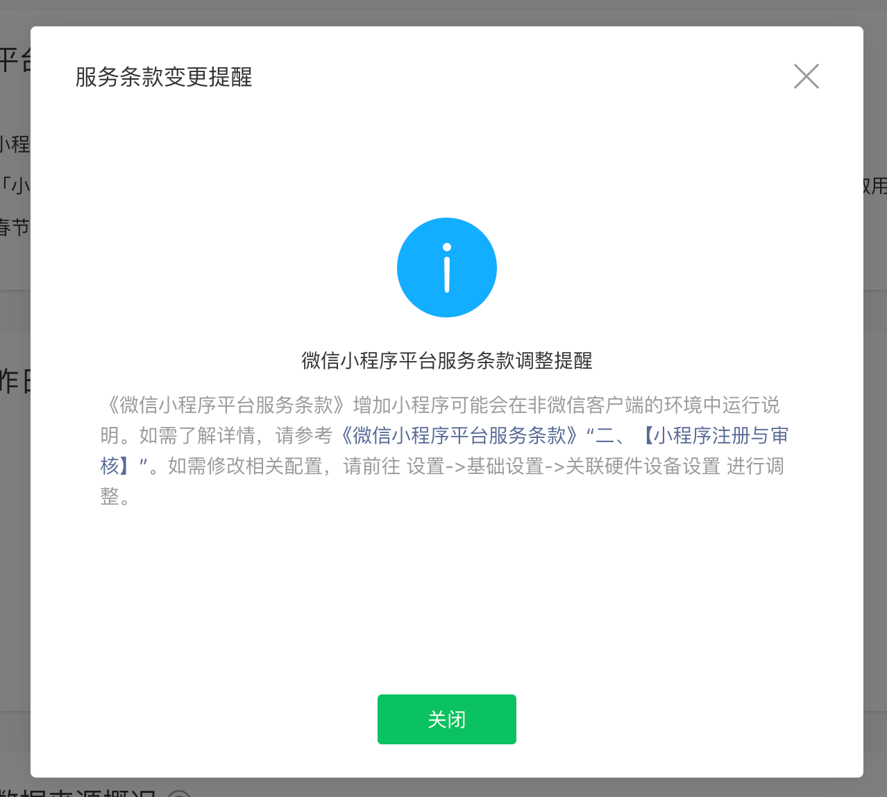

# 微信布局IOT：WMPF

2020微信公开课Pro，微信推出WMPF——WeChat Mini-Program Framework——微信小程序框架。
第一反应就是，微信要布局物联网了。

#### 官方介绍
https://developers.weixin.qq.com/doc/oplatform/Miniprogram_Frame/
>为解决在非通用型计算设备上使用小程序的诉求，我们推出了小程序硬件框架(Wechat Mini-Program Framework)，简称WMPF。WMPF 作为一个运行环境，能让硬件设备(非通用型计算设备)在无条件运行微信客户端的情况下运行微信小程序，目前已支持安卓设备。
>
>常见的通用型计算设备包括但不限于智能手机、笔记本电脑、台式电脑以及通用平板电脑等。

#### 个人解析
+ 脱离微信客户端运行小程序，即直接运行小程序，无需从微信入口
+ 作为一个运行环境，支持多设备：当前支持设备还不够
+ 类似于PWA——Progressive Web Apps，依赖浏览器的运行环境带来类原生应用的体验：硬件->操作系统->浏览器|运行环境->应用
+ 天然集成微信生态能力

布局IOT，介于硬件设备之上的操作系统和应用之间的一个位置。

对于应用开发者而言，应用发布|运行到不同设备将只用写一套代码。
对硬件开发者而言，可以申请接入WMPF，接入之后硬件上便可运行小程序应用，应该是省了硬件发布前期对基础软件的投入（避免光秃秃硬件上市）。而且还可以有用微信生态的支持。

#### 当前形势

最近，Mac版微信可拉起微信小程序了！如图拉起大众点评
甚至有独立图标

对于小程序开发者而言，小程序后台已经提醒服务条款调整：微信小程序可能在非微信客户端环境中打开。

#### 未来
CSDN在01-20对WMPF团队的采访中提到，
https://zhuanlan.zhihu.com/p/103583227
>谈到WMPF 在近期的研发方向，主要有三点：
>
>1、智能屏幕场景。在理想的预期下，期待能在智能屏幕上诞生出出色的小程序 SaaS 软件服务商和硬件的解决方案商。
>
>2、目前 WMPF 支持安卓平台，未来希望能扩展到更多底层操作系统平台。
>
>3、探索5G 技术下的新发展。随着 5G 技术的发展，团队相信基于 WMPF 构建的小程序在设备上的应用响应速度和更新的实时性都会变得更好。

我认为2支持更多硬件对WMPF团队来说是个挑战，现在各大公司都在布局IOT，物联网设备众多，全面覆盖很难，未来怎样难以预料。
而且小程序无法替代原生应用，各有场景。但是对于中小商家而言，小程序或许已经足够。期待WMPF扩展更多平台。
3是必然趋势。
1是我们开发者可以开始准备的。

