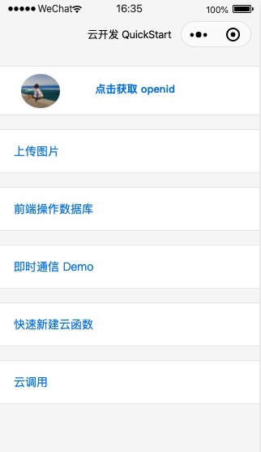
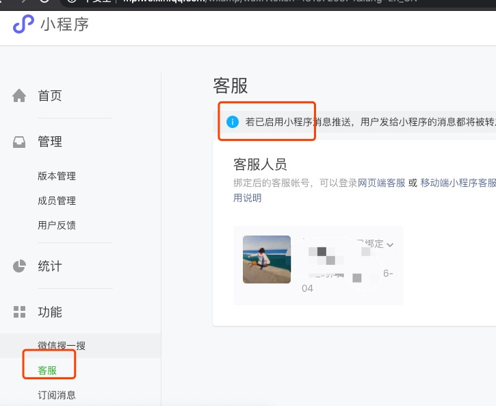

## 从云开发模板一撇云开发提供的能力
管中窥豹，可见一斑

### 点击获取Openid
获取用户Openid：授权用户信息，纯客户端微信生态能力

参考文档：
[button open-type](https://developers.weixin.qq.com/miniprogram/dev/component/button.html)
[wx.authorize](https://developers.weixin.qq.com/miniprogram/dev/api/open-api/authorize/wx.authorize.html)

另，进入即显示用户头像，无需授权可获得当前用户部分信息，也是这个模块想要体现的微信小程序能力。同样是客户端能力，与云开发无关

参考文档：[open-data](https://developers.weixin.qq.com/miniprogram/dev/component/open-data.html)

### 上传图片
#### 选择图片：客户端功能
参考文档：
[wx.chooseImage](https://developers.weixin.qq.com/miniprogram/dev/api/media/image/wx.chooseImage.html)

####上传图片：云开发功能 
云开发提供的**文件存储**

参考文档：
[云存储](https://developers.weixin.qq.com/miniprogram/dev/wxcloud/guide/storage.html#%E5%AD%98%E5%82%A8)
[wx.cloud.uploadFile](https://developers.weixin.qq.com/miniprogram/dev/wxcloud/reference-sdk-api/storage/uploadFile/client.uploadFile.html)

### 前端操作数据库

云开发数据库分前端操作和云端操作，方法类似。此示例为前端操作
+ 创建
+ 增删改查

参考文档：
[云开发数据库](https://developers.weixin.qq.com/miniprogram/dev/wxcloud/guide/database.html)

### 即时通信Demo

数据库实时数据推送能力：监听数据库数据变化

参考文档：
[实时数据推送
](https://developers.weixin.qq.com/miniprogram/dev/wxcloud/guide/database/realtime.html)

此示例还有很多细节，值得细细研究。
包括有对设备安全区域的判断作样式调整、向上滚动数据拉取、向下滚动到底部、全屏预览图片[wx.previewImage](https://developers.weixin.qq.com/miniprogram/dev/api/media/image/wx.previewImage.html)等

### 快速新建云函数

云函数功能
参考文档：[云函数](https://developers.weixin.qq.com/miniprogram/dev/wxcloud/basis/capabilities.html#%E4%BA%91%E5%87%BD%E6%95%B0)

剪贴板功能：纯客户端功能
参考文档：[wx.setClipboardData](https://developers.weixin.qq.com/miniprogram/dev/api/device/clipboard/wx.setClipboardData.html)
### 云调用
[云调用文档](https://developers.weixin.qq.com/miniprogram/dev/wxcloud/guide/openapi/openapi.html)

#### 服务端调用
+ 发送订阅消息：cloud.openapi.subscribeMessage.send
+ 获取永久有效小程序码：cloud.openapi.wxacode.get

[服务端接口列表](https://developers.weixin.qq.com/miniprogram/dev/api-backend/)，带云调用标签即云开发可用

 示例中还有，调起客户端小程序订阅消息界面[wx.requestSubscribeMessage](https://developers.weixin.qq.com/miniprogram/dev/api/open-api/subscribe-message/wx.requestSubscribeMessage.html)

#### 开放数据调用

客户端和云端调用开放数据，其中敏感信息只能通过云端获取

云开发在获取敏感数据时，省去鉴权和加解密步骤

客户端，两个示例
+ werun：wx.getWeRunData
    微信运动具体信息都是敏感信息
+ userInfo：button open-type=getUserInfo即可
    openId等是敏感信息

云端，werun和userInfo是同样的方式：
+ 直接callFunction，参数带上客户端获取到的cloudID即可
+ cloud.getOpenData，参数中有客户端获取到的cloudID

参考文档：
[服务端获取开放数据
](https://developers.weixin.qq.com/miniprogram/dev/framework/open-ability/signature.html)[Cloud.getOpenData](https://developers.weixin.qq.com/miniprogram/dev/wxcloud/reference-sdk-api/open/Cloud.getOpenData.html)

#### 消息推送
需要云开发控制台和云开发代码下config.json中配置后使用即将微信提供的客服消息，替换为云函数处理，且不能共存。即后台设置了客服，云函数无法接收到用户发送的消息。如图

参考文档：
[云函数处理消息](https://developers.weixin.qq.com/miniprogram/dev/framework/server-ability/message-push.html#option-cloud)

