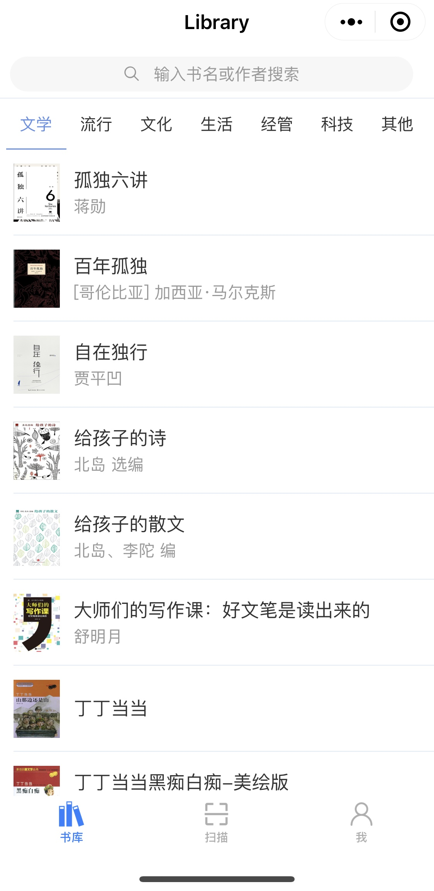
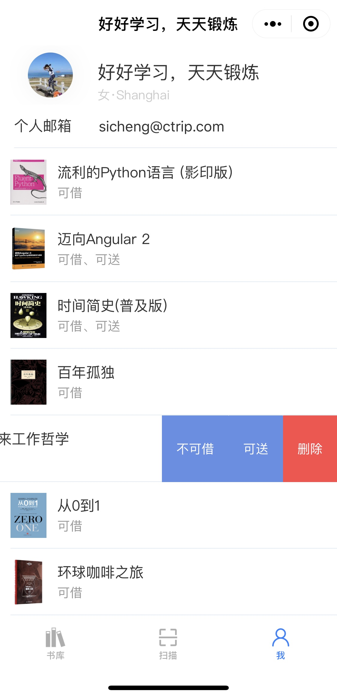
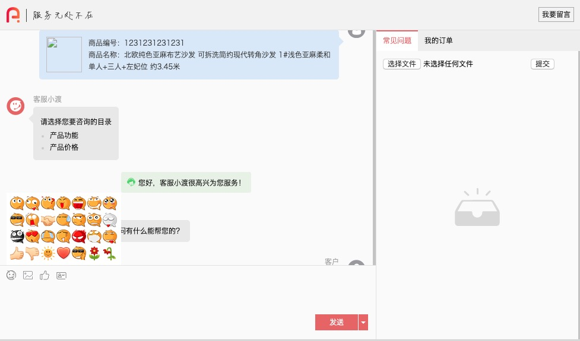
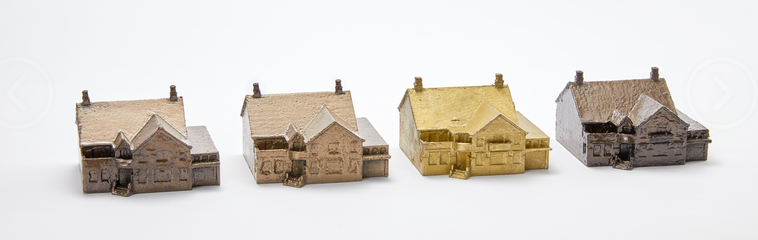

## 简介

擅长

### 微信生态

+ 微信公众号：公众号运营（机器人）以及公众号H5数据互通
+ 微信小程序：云开发(PublicLibrary)，小程序+AI(暂未发布)

### 数据

客户端数据抓取、数据报表

## 项目

### 小程序项目
+ Public Library
    
    图书分享借阅小程序，扫书的条形码即可分享
     
      
    微信识别二维码：
    
    
    或搜索PublicLibrary

### H5项目
+ 上海19年进博会宣传
    微信识别二维码：
        
    
        
    或[点击链接](http://maka.im/pcviewer/7909972/H8VLE4FX)
+ 奥莱营销
        
        [点击链接，手机端访问更佳](https://monvhh.github.io/20170513/)

### Web项目

+ 客服

### APP

### 3d设计

### 平面设计
+ 科美机械企业宣传
    
    

### 装修设计

## 技术栈

### 设计

+ [Bootstrap](https://v4.bootcss.com/docs/4.0/examples/)
+ [Material design](https://material.io/design/)
+ [Ant design](https://ant.design/)

### 客户端

+ React
+ Angular
+ Node(Express|Koa)
+ [微信公众号](https://developers.weixin.qq.com/doc/offiaccount/Getting_Started/Overview.html)|[微信小程序](https://developers.weixin.qq.com/miniprogram/dev/framework/)
+ [Echarts](https://www.echartsjs.com/examples/zh/index.html)
+ [HighCharts](https://www.highcharts.com/demo)

### 服务端

+ Java
+ .Net
+ MongoDB
+ MySQL
+ SqlServer
